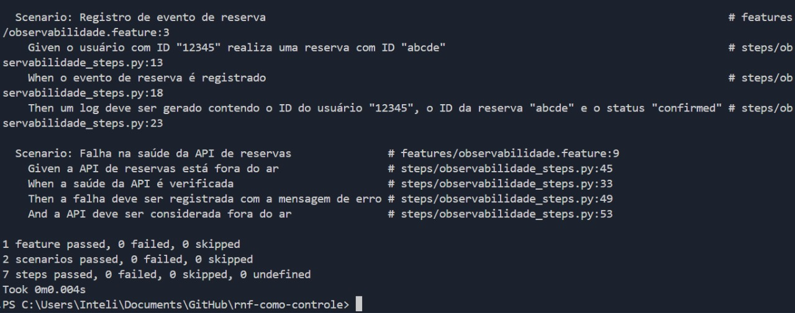

# Documentação de Requisitos - Observabilidade no Airbnb

&emsp;&emsp; O Airbnb é uma plataforma de aluguel de acomodações que conecta anfitriões e hóspedes ao redor do mundo. Para garantir a confiabilidade da plataforma, a observabilidade é essencial, permitindo monitoramento e diagnóstico em tempo real das operações.

## Requisito Funcional (RF)

### RF1 - Registro de eventos de reserva

**Descrição:** O sistema deve registrar eventos relevantes ao processo de reserva, incluindo criação, modificação e cancelamento de reservas pelos usuários.

**Critérios de Aceitação:**

- Deve armazenar logs detalhados de cada evento de reserva.

- Logs devem conter ID do usuário, ID da reserva, timestamp e status da operação.

## Requisito Não Funcional (RNF)

### RNF1 - Monitoramento da saúde da API de reservas

**Descrição:** O sistema deve monitorar e registrar a disponibilidade e tempo de resposta da API responsável pelo gerenciamento de reservas.

**Critérios de aceitação:**

- Deve registrar logs de requisições à API de reservas, incluindo tempo de resposta e status HTTP.

- Deve alertar quando a API estiver fora do ar ou responder com erro.

## Como Rodar os Testes

**Pré-requisitos:**

&emsp;&emsp; Certifique-se de que o Python 3.x esteja instalado. Além disso, instale as dependências necessárias com o comando:

```bash
pip install -r requirements.txt
```

## Executando os Testes:

Para rodar os testes de comportamento com **behave**, use o comando:

```bash
behave
```

&emsp;&emsp; Isso irá executar os testes definidos nos arquivos .feature e .py, gerando logs de eventos e monitoramento da saúde da API.

## Resultados dos Testes

&emsp;&emsp; Aqui está um exemplo do print dos resultados dos testes:

<div align="center">
  <sub>Figura 1 - Diagrama </sub>
  
  <sup>Fonte: O autor (2025)</sup>
</div>

&emsp;&emsp; No exemplo acima, o sistema registrou o evento da reserva e também fez a verificação da saúde da API de reservas, retornando uma resposta 404, indicando que a API pode não ter encontrado o recurso esperado.

## Conclusão

&emsp;&emsp; A implementação da observabilidade no Airbnb permite monitorar de forma eficaz tanto os eventos de reserva quanto a saúde da API de reservas. Com isso, é possível:

- Registrar eventos de reservas de maneira detalhada e acompanhar mudanças no sistema.

- Monitorar a saúde da API, identificando se a API está operacional ou se houve falhas, possibilitando ações corretivas rápidas.

&emsp;&emsp; Esses recursos garantem que a plataforma seja mais confiável e facilite o diagnóstico de problemas, proporcionando uma experiência de usuário mais estável e previsível.